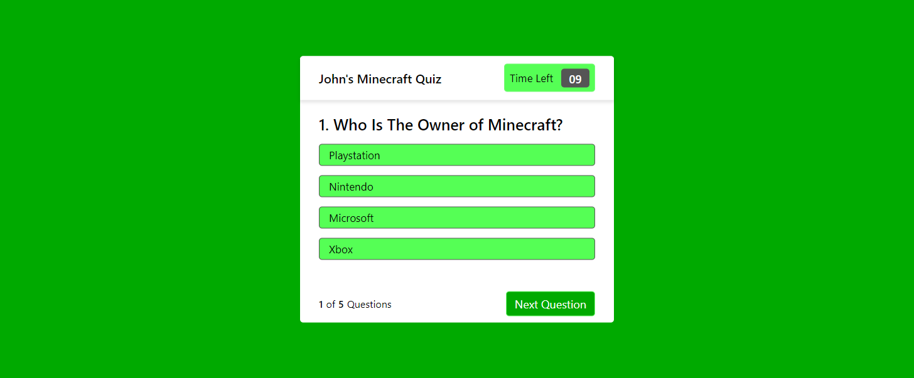

# Minecraft Quiz

## Your Task

Multiple choice Minecraft quiz created using vanilla Javascript and CSS


## User Story

```
AS A coding boot camp student
I WANT to build a timed quiz on Minecraft for my son that stores high scores
SO THAT he can gauge his progress compared to his peers
```

## Acceptance Criteria

```
GIVEN the User is taking a code quiz
WHEN the User clicks the start button
THEN an information box pops up telling the User about the Quiz
WHEN the User clicks Start Quiz
THEN the User is taken to the first question and a timer starts
WHEN the User answers a question
THEN the User is presented with another question
WHEN the User answers a question incorrectly
THEN time is subtracted from the clock
WHEN all questions are answered or the timer reaches 0
THEN the game is over
WHEN the game is over
THEN the User can save their initials and score
```

## Screenshot

The following screenshot shows the application functionality:



## Link to Deployed Application

https://chuck2076.github.io/JavaScriptQuiz_CRS/

